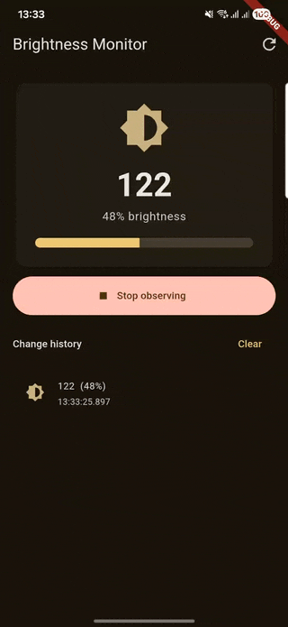
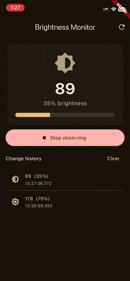

# screen_brightness_monitor

A Flutter FFI plugin that monitors system screen brightness on Android and iOS.

Uses swiftgen and jnigen to generate native bindings.

## Features

- Read the current screen brightness (0–255)
- Listen to brightness changes as a stream
- Native implementations: Android (`ContentObserver`) and iOS (`UIScreen.brightnessDidChangeNotification`)

| Android               | iOS               |
| --------------------- | ----------------- |
|  |  |

## Usage

```dart
import 'package:screen_brightness_monitor/screen_brightness_monitor.dart';

// Create a monitor (auto-selects Android or iOS implementation)
final monitor = BrightnessMonitor();

// Read current brightness
print(monitor.brightness); // 0–255

// Listen to changes
final subscription = monitor.onBrightnessChanged.listen((brightness) {
  print('Brightness changed: $brightness');
});

// Stop listening and clean up
subscription.cancel();
monitor.dispose();
```

## Platform Support

| Platform | Supported |
| -------- | --------- |
| Android  | ✅        |
| iOS      | ✅        |

## Regenerate bindings

**Android (jnigen) — build first, then generate:**

```
cd example && flutter build apk --release && cd ..
dart run tool/jnigen.dart
```

**iOS (swiftgen):**

```
dart run tool/swiftgen.dart
```
